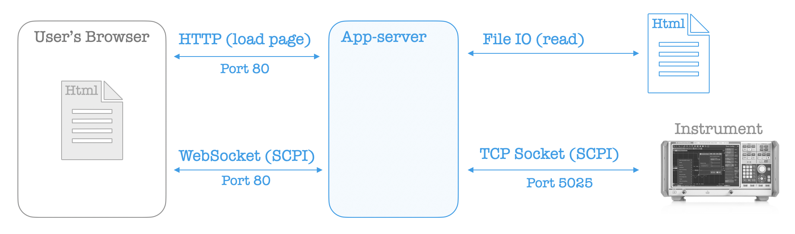

# Rohde & Schwarz App Server

App Server is an HTTP server that simplifies instrument control applications by providing a static file server and a WebSocket proxy to the instrument.

## Requirements

-   Python 3.8.7+
-   Python packages as installed from `requirements-lock.txt`

## Build Scripts

For automated build steps for both Bash and Batch (`cmd.exe`), see `scripts/`.

## Architecture



App Server is an HTTP server with two parts:

1.  Static File Server
2.  Websocket Proxy

### Static File Server

The static file server lists the contents of the application directory and serves the application files located there.

Applications can then be copy-deployed into the application directory, either as inlined HTML or as separate files.

### WebSocket Proxy

A WebSocket proxy is created to provide SCPI access to the instrument, typically on TCP Port 5025.

## Command Line Interface (CLI)

```comments
usage: app-server [-h] [--host HOST] [--port PORT] [--instr-address INSTR_ADDRESS]
         [--instr-port INSTR_PORT] [--open-browser]
         directory

positional arguments:
  directory

optional arguments:
  -h, --help            show this help message and exit
  --host HOST
  --port PORT
  --instr-address INSTR_ADDRESS
  --instr-port INSTR_PORT
  --open-browser
```

## Example

A simple instrument control example is provided.


See [apps/hello-world.html](apps/hello-world.html).
